## Gesture recognition
### Describe
Recognizing gestures of letters of the Russian alphabet with mediapipe hand tracker.
A model from the mediapipe framework is used for palm detection. Gestures classified by landmarks using logistic regression.
To record a word, you need to press "S", record the word using gestures, and press "S" again. After that, using the Levenshtein distance, the closest word to the entered word is output
#### Supported gestures
<table>
  <tr>
    <td style="border: none;"> 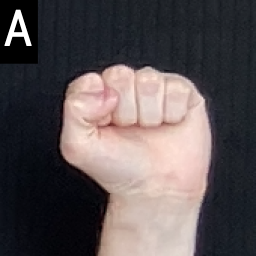</td>
    <td style="border: none;"> 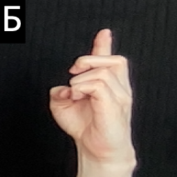</td>
    <td style="border: none;"> 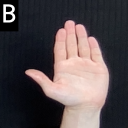</td>
    <td style="border: none;"> 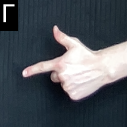</td>
   </tr>
   <tr>
    <td style="border: none;"> 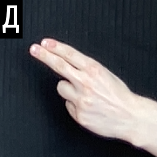</td>
    <td style="border: none;"> 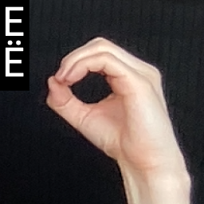</td>
    <td style="border: none;"> 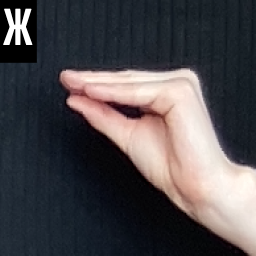</td>
    <td style="border: none;"> 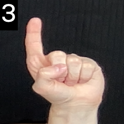</td>
  </tr>
   <tr>
   <td style="border: none;"> 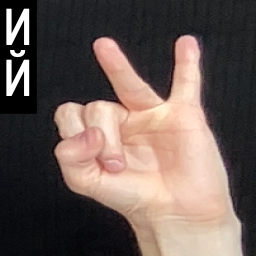</td>
   <td style="border: none;"> 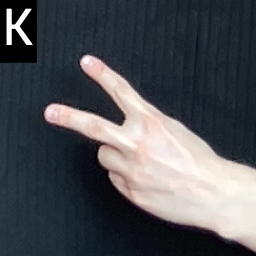</td>
    <td style="border: none;"> 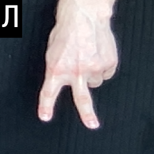</td>
    <td style="border: none;"> 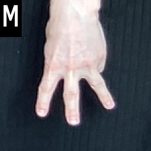</td>
  </tr>
  <tr>
   <td style="border: none;"> 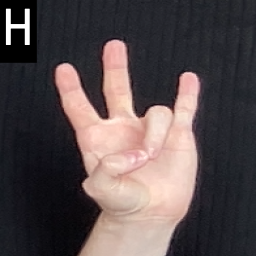</td>
   <td style="border: none;"> 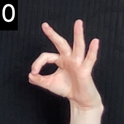</td>
    <td style="border: none;"> 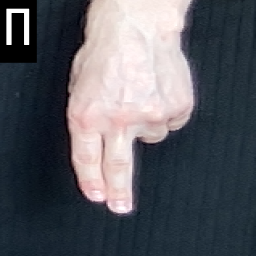</td>
    <td style="border: none;"> 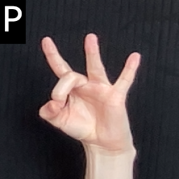</td>
  </tr>
  <tr>
   <td style="border: none;"> 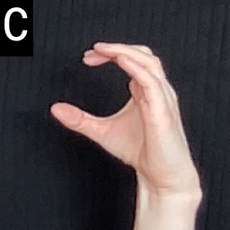</td>
   <td style="border: none;"> 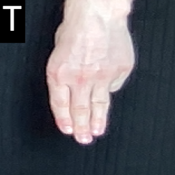</td>
    <td style="border: none;"> 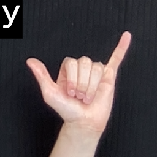</td>
    <td style="border: none;"> 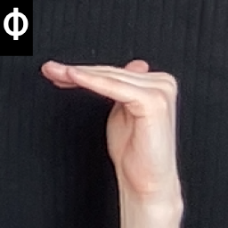</td>
  </tr>
  <tr>
   <td style="border: none;"> 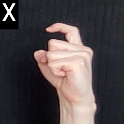</td>
   <td style="border: none;"> 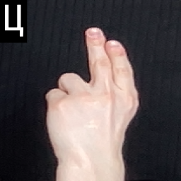</td>
    <td style="border: none;"> 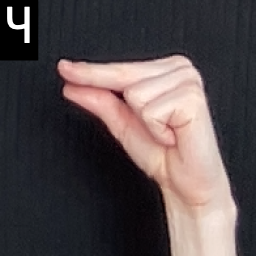</td>
    <td style="border: none;"> </td>
  </tr>
  <tr>
   <td style="border: none;"> 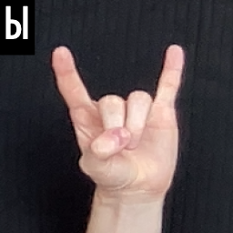</td>
   <td style="border: none;"> 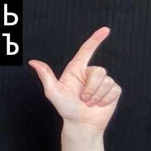</td>
    <td style="border: none;"> 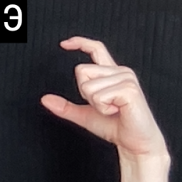</td>
    <td style="border: none;"> 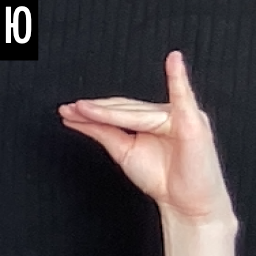</td>
  </tr>
  <tr>
   <td style="border: none;"> 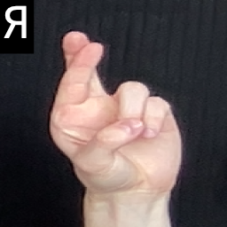</td>
  </tr>
</table>

#### Example of work

##### Recording word

### Instructions for running:

1) Clone this repository:

      `git clone https://github.com/manosh7n/gesture_recognition.git`

      `cd gesture_recognition`
2) Create virtual environment:

     `python -m venv env`

      For linux or macOS:
      `source ./env/bin/activate`

      For Windows:
      `.\env\Scripts\activate.bat`

3) Install the necessary packages:

      `python -m pip install -r requirements.txt`

4) Run App.py:

   `python App.py`

5) To turn it off click *Esc* or *q*

##### Possible problem

If the program shuts down immediately after starting, you can change the `DEVICE_ID` value in `./utils/GlobalVar.py` from 0 to [1, 2, 3, 4]. In my case, the webcam is at number 0.
