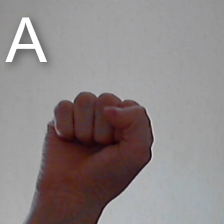
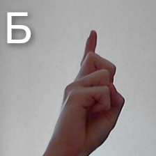
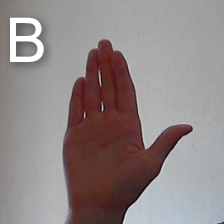
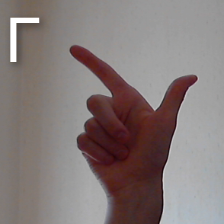
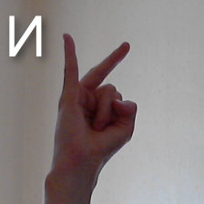
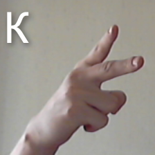
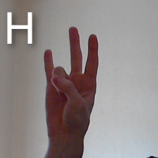
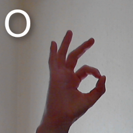
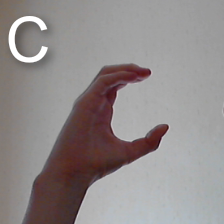

## Gesture recognition
### Describe
Program for recognizing gestures of letters of the Russian alphabet. 
A model from the mediapipe framework is used for palm detection. Gesture classification takes place in two stages: 
- the selected area of the palm is classified by the pre-trained mobilenetv2 model
- then the gesture is classified by key points using logistic regression
- then the prediction results are averaged with a large weight for the LR classifier

#### Supported gestures
<table>
  <tr>
    <td style="border: none;"> </td>
    <td style="border: none;"> </td>
    <td style="border: none;"> </td>
   </tr>
   <tr>
    <td style="border: none;"> </td>
    <td style="border: none;"> </td>
    <td style="border: none;"> </td>
    
  </tr>
   <tr>
   <td style="border: none;"> </td>
   <td style="border: none;"> </td>
    <td style="border: none;"> </td>
  </tr>
</table>

#### Example of work

#### Instructions for running:

1) Clone this repository:

      `git clone https://github.com/manosh7n/gesture_recognition.git`
      
      `cd gesture_recognition`
2) Create virtual environment:

     `python -m venv env`

      For linux:
      `source ./env/bin/activate`

      For Windows:
      `.\env\Scripts\activate.bat`

3) Install the necessary packages:

      `python -m pip install -r requirements.txt`

4) Run app.py:

   `python app.py`

5) To turn it off click *Esc*

##### Possible problem

If the program shuts down immediately after starting, you can change the `DEVICE_ID` value in `app.py` from 0 to [1, 2, 3, 4]. In my case, the webcam is at number 0.
